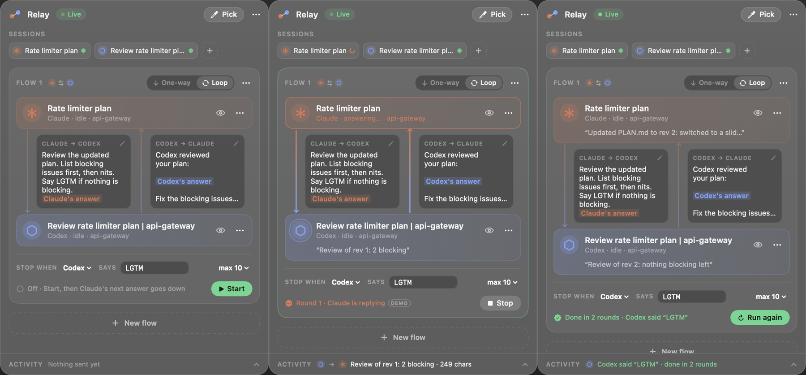

# Relay

Relay connects your Claude Code and Codex sessions so that one session's answer becomes the next session's prompt. You can send answers one way, or run a loop: Claude writes a plan, Codex reviews it, the review goes back to Claude, and so on until one of them says a phrase you picked, like `LGTM`.

It's a small floating window for macOS that works with the Claude Code and Codex sessions you already have open in iTerm2. Nothing about how you run them changes.



*A loop between a Claude session writing a plan and a Codex session reviewing it: ready, mid-run, and finished after Codex said "LGTM".*

## Why

If you use two agents on the same plan, you end up copying Claude's plan into Codex, copying Codex's review back into Claude, and doing it again for every revision. Relay does that copying for you. You write the instructions that travel with each answer once, and decide when the back-and-forth should stop.

## How it works

1. **Pick your sessions.** Click an empty slot in Relay, then click an iTerm pane. A thread follows your cursor out of Relay, latches onto the pane you click, and pulls that session into the slot.
2. **Write what gets sent.** Each connection between the two sessions carries a prompt of your own. The answer is inserted wherever you put `{answer}`.
3. **Pick one-way or loop.** One-way sends the first session's answers to the second. Loop also sends the second session's replies back, with a prompt of their own.
4. **Set when to stop.** Stop when either session (or a particular one) says a phrase, or after a set number of rounds.
5. **Press Start.**

Under the hood, Relay installs a small hook in Claude Code and in Codex. Whenever a turn ends, the hook passes the answer to Relay over a local socket. Relay wraps the answer in your prompt and pastes it into the other pane, just as if you'd pasted it yourself and pressed Return:

```
Claude pane ── Stop hook ──▶ relay-hook ──▶ Relay ── paste ──▶ Codex pane
     ▲                                                             │
     └────────── paste ◀── Relay ◀── relay-hook ◀── Stop hook ─────┘
```

## Requirements

- macOS 14 (Sonoma) or later
- [iTerm2](https://iterm2.com). Relay reads and types into iTerm panes; other terminals aren't supported.
- Xcode Command Line Tools, for Swift 5.9 or later: `xcode-select --install`
- [Claude Code](https://docs.claude.com/en/docs/claude-code) and/or the [Codex CLI](https://github.com/openai/codex)

## Install

```sh
git clone https://github.com/ashpect/session-connectors.git
cd session-connectors
./install.sh
```

`install.sh` does the following:

- builds Relay and copies it to `~/Applications/Relay.app`
- puts the hook program in `~/.relay/relay-hook`
- registers the hook for `UserPromptSubmit` and `Stop` in `~/.claude/settings.json` (Claude Code) and `~/.codex/hooks.json` (Codex), but only for the agents it finds. Nothing else in those files changes, and each file is backed up as `*.relay-backup` before Relay touches it the first time.
- opens Relay

You can safely run it again; that's also how you update.

### Finish setup (one time)

1. **Allow iTerm control.** macOS asks *"Relay wants to control iTerm2"*. Click **Allow**. If you missed it, go to System Settings → Privacy & Security → Automation → Relay and turn on iTerm2.
2. **Trust the hooks in Codex.** The next time Codex starts, it shows *"Hooks need review"*. Choose **Trust all and continue**. Codex sessions that were already running need a restart (`codex resume`).
3. **Load the hooks in Claude Code.** New sessions pick them up on their own. In Claude sessions that were already open, run `/hooks` once, or restart them with `claude --continue`.

If a hook is missing, Relay shows a warning at the top of its window.

## Using Relay

Open Relay from the menu bar icon (two dots joined by a thread), or press **⌃⌥K** from anywhere.

1. **Fill a flow.** Click the top slot, then click the pane whose answers should go first, for example the Claude session writing your plan. Click the bottom slot, then click the pane that should receive them, for example Codex reviewing it. You can also press **Pick** twice (it fills the top slot, then the bottom), drag a session chip onto a slot, or use **Choose**.
2. **Write the prompts.** Click the prompt on a connection to edit it. The answer goes where `{answer}` is. If you leave `{answer}` out, the answer is added at the end, and an empty prompt sends the answer as-is.
3. **Turn on Loop** if the reply should come back up to the first session.
4. **Set the stop rule:** stop when *either / Claude / Codex* says a phrase, with a maximum number of rounds as a backstop. It helps to ask for the phrase in your prompt, for example "Say LGTM if nothing is blocking."
5. **Press Start.** Relay sends the first session's latest answer right away. If that session hasn't answered since Relay started, its next answer goes first. **Stop** ends a flow, and **Live / Paused** in the header pauses every flow.

Want to look around before connecting real sessions? Choose **⋯ → Load demo flow**.

### Example: a plan-review loop

| Direction | Prompt |
|---|---|
| Claude → Codex | `Review the updated plan. List blocking issues first, then nits. Say LGTM if nothing is blocking.` |
| Codex → Claude | `Codex reviewed your plan:` `{answer}` `Fix the blocking issues and update PLAN.md.` |
| Stop | when **Codex** says `LGTM`, at most 10 rounds |

Ask Claude for the plan as you normally would. Once it answers, Relay takes it from there.

### Shortcuts

| Keys | What they do |
|---|---|
| ⌃⌥K | Show or hide Relay |
| ⌥⌘P | Pick the pane you're in (from iTerm), or start picking |
| Right-click or Esc | Cancel a pick |
| Double-click a session's name | Rename it |

The session menu (**⋯** on each session) also has Reveal in iTerm, Replace, and Remove, and the eye icon shows a live view of the pane.

### Good to know

- **Relay types into panes.** Don't type in a pane that's part of a running flow, or your half-written text will mix with Relay's message.
- **A busy session isn't interrupted.** If the receiving session is mid-turn, Relay waits for that turn to end and then sends.
- **Relay only hears turns while it's running.** When Relay is closed, the hook exits immediately and does nothing.
- **The hook runs on every turn of every session.** It's a tiny program that forwards the event and prints nothing. Relay ignores sessions that aren't in a flow.
- **Your flows are saved** in `~/.relay/state.json`.
- **Each time you rebuild or update,** macOS asks again for permission to control iTerm. That's because Relay is built locally without a signing certificate.

## Troubleshooting

**Nothing happens when a turn ends.** Check the three setup steps above: the hooks are installed, Codex trusts them, and the Claude session has loaded them. To see what Relay hears, turn on logging:

```sh
touch ~/.relay/debug        # every hook call → ~/.relay/hook.log, everything Relay does → ~/.relay/relay.log
rm ~/.relay/debug           # turn it off again
```

**"Relay can't read iTerm yet."** Give Relay permission to control iTerm2 (setup step 1).

**"Sent to Codex, but it hasn't confirmed receiving it."** The receiving pane was probably showing a dialog, such as a permission prompt, or its hooks aren't trusted yet.

**The window is gone.** Press ⌃⌥K or click the menu bar icon. Opening Relay again from Spotlight also brings it back.

## Update

```sh
git pull && ./install.sh
```

## Uninstall

```sh
./uninstall.sh
```

This removes Relay's hook entries (and nothing else) from your Claude Code and Codex settings, along with `~/.relay` and `~/Applications/Relay.app`. The `*.relay-backup` copies of your settings stay where they are. Codex also keeps a trust record for the removed hooks in `~/.codex/config.toml` (under `[hooks.state]`); it's harmless, and you can delete it if you like.

## Development

```sh
./build.sh --open    # build into ./build and relaunch (doesn't touch ~/Applications)
```

| File | What's in it |
|---|---|
| `Sources/Relay/App.swift` | App startup, the floating panel, menu bar icon, global shortcuts |
| `Sources/Relay/Model.swift` | Sessions, flows, and the engine that moves answers between sessions |
| `Sources/Relay/Hook.swift` | `relay-hook` (the program the agents run) and the socket server that receives its events |
| `Sources/Relay/ITerm.swift` | Reading panes and pasting into them through iTerm's AppleScript interface |
| `Sources/Relay/Picker.swift`, `Thread.swift` | The pick gesture and the thread that follows your cursor |
| `Sources/Relay/Views.swift`, `FlowViews.swift` | The SwiftUI interface |
| `scripts/hooks.py` | Adds and removes Relay's hook entries in the agents' settings |

Both agents report the answer in their `Stop` hook as `last_assistant_message`. The hook runs inside the pane's process tree, so `$ITERM_SESSION_ID` identifies the pane. For Codex setups where that variable isn't available, Relay falls back to matching the thread to a pane by folder and by the text on screen.

To render the interface to an image without a screen, which is handy for checking layout changes:

```sh
build/Relay.app/Contents/MacOS/Relay --snapshot out.png --demo [--sim --at 3] [--oneway] [--peek]
```

## Limitations

- macOS and iTerm2 only.
- Relay is built from source and isn't signed, which is why macOS asks for iTerm permission again after each update.
